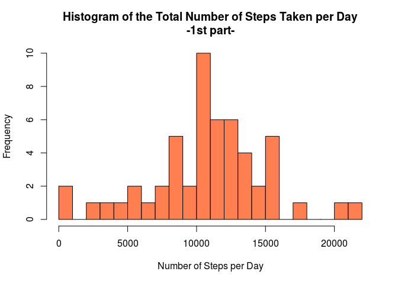
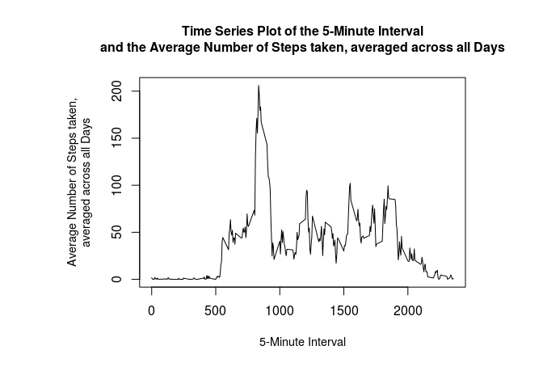
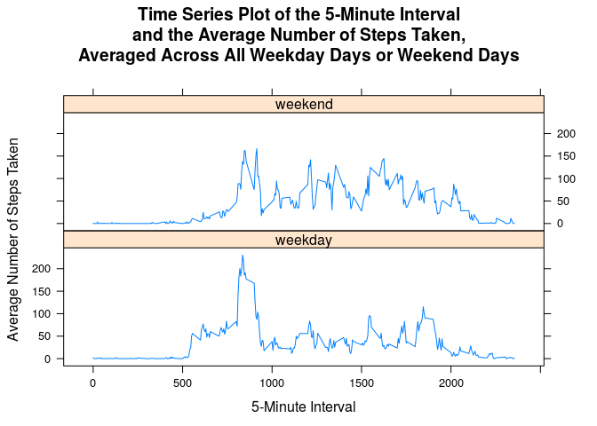

# Reproducible Research: Peer Assessment 1
Author: Helmut Wittneben  
Date: `r Sys.Date()`<br><br>  
# 1. Introduction

It is now possible to collect a large amount of data about personal movement using activity monitoring devices such as a Fitbit, Nike Fuelband, or Jawbone Up. These type of devices are part of the “quantified self” movement – a group of enthusiasts who take measurements about themselves regularly to improve their health, to find patterns in their behavior, or because they are tech geeks. But these data remain under-utilized both because the raw data are hard to obtain and there is a lack of statistical methods and software for processing and interpreting the data.

This assignment makes use of data from a personal activity monitoring device. This device collects data at 5 minute intervals through out the day. The data consists of two months of data from an anonymous individual collected during the months of October and November, 2012 and include the number of steps taken in 5 minute intervals each day.

The document presents the results of the Reproducible Research's Peer Assessment 1 in a report using **a single R markdown document** that can be processed by **knitr** and be transformed into an HTML file.  

Through this report you can see that activities on weekdays mostly follow a work related routine, where we find some more intensity activity in little a free time that the employ can made some sport. 

An important consideration is the fact of our data presents as a t-student distribution (see both histograms), it means that the impact of imputing missing values with the mean has a good impact on our predictions without a significant distortion in the distribution of the data.  

### 1.1 Configure the R environment
Throughout this report  **always use echo = TRUE** when writing code chunks in the R markdown document, so that someone else will be able to read the code. 

Set the golbal options **echo** to *TRUE* and **results** to *'hold'* which automatically holds printing of all output to the end as global options for this document.


```r
library(knitr)
opts_chunk$set(echo = TRUE, results = 'hold')
Sys.setlocale("LC_TIME", "C")
```

```
## [1] "C"
```

### 1.2 Load required libraries

```r
library(ggplot2)                # use ggplot2 for plotting figures
```


# 2. Loading and preprocessing the data

This assignment makes use of data from a personal activity monitoring device. This device collects data at 5 minute intervals through out the day. The data consists of two months of data from an anonymous individual collected during the months of October and November, 2012 and include the number of steps taken in 5 minute intervals each day.  


### 2.1 Load the required data

**Note**: It is assumed that the file activity.csv is in the current working directory.   
The statement `read.csv` is used to load the data.


```r
activity <- read.csv('activity.csv', header = TRUE, sep = ",",
                  colClasses=c("integer", "character", "integer"))
```

### 2.2 Preprocess/transform the data

```r
activity$date <- as.Date(activity$date, format = "%Y-%m-%d")
# activity$interval <- as.factor(activity$interval)
```

Check the data using `str()` method:


```r
str(activity)
```

```
## 'data.frame':	17568 obs. of  3 variables:
##  $ steps   : int  NA NA NA NA NA NA NA NA NA NA ...
##  $ date    : Date, format: "2012-10-01" "2012-10-01" ...
##  $ interval: int  0 5 10 15 20 25 30 35 40 45 ...
```


# 3. What is mean total number of steps taken per day?

For this part of the assignment the missing values in the dataset are ignored.


```r
# subset data frame to values without na for later use
noNA_activity <- activity[complete.cases(activity),]
```

### 3.1 Calculate the total number of steps per day.


```r
# total number of steps taken per day
total <- aggregate(steps ~ date, noNA_activity, sum)
# add descriptive variable names
names(total)[2] <- "sum_steps"
# check out new data frame
head(total, 5)
```

```
##         date sum_steps
## 1 2012-10-02       126
## 2 2012-10-03     11352
## 3 2012-10-04     12116
## 4 2012-10-05     13294
## 5 2012-10-06     15420
```

### 3.2 Make a histogram of the total number of steps taken each day.


```r
# plot histogram, using breaks purely for better visuals.
hist(
    total$sum_steps,
    col = "coral",
    main = "Histogram of the Total Number of Steps Taken per Day\n-1st part-",
    xlab = "Number of Steps per Day",
    breaks = 20
)
```

 

### 3.3 Calculate and report the mean and median of total number of steps taken per day


```r
# mean
meanOfSteps <- mean(total$sum_steps)
# median
medianOfSteps <- median(total$sum_steps)
```
The mean is **10766.189** and 
the median is **10765**.


# 4. What is the average daily activity pattern?
  
### 4.1 Make a time series plot.

**x-axis:** 5-minute interval  
**y-axis:** average number of steps taken, averaged across all days


```r
# the average number of steps taken, averaged across all days for each 5-minute
# interval
int5mins <- aggregate(steps ~ interval, noNA_activity, mean)
# add descriptive variable names
names(int5mins)[2] <- "mean_steps"
# check out new data frame
head(int5mins, 5)
```

```
##   interval mean_steps
## 1        0  1.7169811
## 2        5  0.3396226
## 3       10  0.1320755
## 4       15  0.1509434
## 5       20  0.0754717
```


```r
# define plot margins sizes to provide long text labels.
par(mai = c(1.3,1.8,1,1))
par(cex.main=1.0, cex.lab=0.9)

# plot time series
plot(
    x = int5mins$interval,
    y = int5mins$mean_steps,
    type = "l",
    main = "Time Series Plot of the 5-Minute Interval\nand the Average Number of Steps taken, averaged across all Days",
    xlab = "5-Minute Interval",
    ylab = "Average Number of Steps taken,\naveraged across all Days"
)
```

 

### 4.2 Which 5-minute interval, on average across all the days in the dataset, contains the maximum number of steps?


```r
int5mins[int5mins$mean_steps==max(int5mins$mean_steps),]
```

```
##     interval mean_steps
## 104      835   206.1698
```


# 5. Imputing missing values

Note that there are a number of days/intervals where there are missing values 
(coded as NA). The presence of missing days may introduce bias into some 
calculations or summaries of the data.

### 5.1 Calculate and report the total number of missing values in the dataset 

Total number of rows with NAs:


```r
nrow(activity[is.na(activity$steps),])
```

```
## [1] 2304
```

### 5.2 Devise a strategy for filling in all of the missing values in the dataset.

The strategy does not need to be sophisticated. For example, you could use the 
mean/median for that day, or the mean for that 5-minute interval, etc.

I will use the mean for the 5-minute interval to populate NA values for a given interval.

### 5.3 Create a new dataset that is equal to the original dataset but with the missing data filled in.


```r
# merge original activity data frame with interval data frame
mergedActivity <- merge(activity, int5mins, by = 'interval', all.y = F)
# merge NA values with averages rounding up for integers
mergedActivity$steps[is.na(mergedActivity$steps)] <- as.integer(
    round(mergedActivity$mean_steps[is.na(mergedActivity$steps)]))
# drop and reorder columns to match original activity data frame
idx <- names(activity)
mergedActivity <- mergedActivity[idx]
```

### 5.4 Make a histogram of the total number of steps taken each day and Calculate and report the mean and median total number of steps taken per day.

```r
# total number of steps taken per day
compTotal <- aggregate(steps ~ date, mergedActivity, sum)
# add descriptive variable names
names(compTotal)[2] <- "sum_steps"
# check out new data frame
head(compTotal, 5)
```

```
##         date sum_steps
## 1 2012-10-01     10762
## 2 2012-10-02       126
## 3 2012-10-03     11352
## 4 2012-10-04     12116
## 5 2012-10-05     13294
```


```r
# plot histogram, using breaks purely for better visuals.
hist(
    compTotal$sum_steps,
    col = "light blue",
    main = "Total Number of Steps Taken Each Day\n-2nd part-",
    xlab = "Total Number of Steps Taken Each Day",
    breaks = 20
)
```

 


```r
# mean
mean(compTotal$sum_steps)
```

```
## [1] 10765.64
```

```r
# median
median(compTotal$sum_steps)
```

```
## [1] 10762
```
**Do these values differ from the estimates from the first part of the assignment?**

They do differ, but ever so slightly.

mean(total) = 10766.19, while mean(compTotal) = 10765.64. Rounding gives the same value.

median(total) = 10765, while median(compTotal) = 10762. 3 steps difference.

**What is the impact of imputing missing data on the estimates of the total daily number of steps?**

This seems to highly depend on how you impute the missing data. Since I used the average for a given interval, there was practically no difference because we basically pulled the averages closer to the inserted average value.


# 6. Are there differences in activity patterns between weekdays and weekends?

### 6.1 Create a new factor variable in the dataset indicating whether a given date is a weekday or weekend day.


```r
# create new data frame
filledActivity <- mergedActivity
# set up logical vector
weekend <- weekdays(as.Date(filledActivity$date)) %in% c("Saturday", "Sunday")
# Fill in weekday column
filledActivity$daytype <- "weekday"
# replace "weekday" with "weekend" where day == Sat/Sun
filledActivity$daytype[weekend == TRUE] <- "weekend"
# convert new character column to factor
filledActivity$daytype <- as.factor(filledActivity$daytype)
# Check out new data frame
str(filledActivity)
```

```
## 'data.frame':	17568 obs. of  4 variables:
##  $ steps   : int  2 0 0 0 0 0 0 0 0 0 ...
##  $ date    : Date, format: "2012-10-01" "2012-11-23" ...
##  $ interval: int  0 0 0 0 0 0 0 0 0 0 ...
##  $ daytype : Factor w/ 2 levels "weekday","weekend": 1 1 2 1 2 1 2 1 1 2 ...
```


```r
head(filledActivity, 5)
```

```
##   steps       date interval daytype
## 1     2 2012-10-01        0 weekday
## 2     0 2012-11-23        0 weekday
## 3     0 2012-10-28        0 weekend
## 4     0 2012-11-06        0 weekday
## 5     0 2012-11-24        0 weekend
```


```r
# double check
weekdays(as.Date(filledActivity$date[3]))
```

```
## [1] "Sunday"
```

### 6.2 Make a panel plot containing a time series plot.

**x-axis:** 5-minute interval  
**y-axis:** average number of steps taken, 
            averaged across all weekday days or weekend days.


```r
# the average number of steps taken, averaged across all days for each 5-minute
# interval
avgInterval <- aggregate(steps ~ interval + daytype, filledActivity, mean)
# add descriptive variable names
names(avgInterval)[3] <- "mean_steps"
# check out new data frame
head(avgInterval, 5)
```

```
##   interval daytype mean_steps
## 1        0 weekday 2.28888889
## 2        5 weekday 0.40000000
## 3       10 weekday 0.15555556
## 4       15 weekday 0.17777778
## 5       20 weekday 0.08888889
```

Below you can see the panel plot comparing the average number of steps taken per 5-minute interval across weekdays and weekends:


```r
# plot time series
library(lattice)
xyplot(
    mean_steps ~ interval | daytype,
    avgInterval,
    type = "l",
    layout = c(1,2),
    main = "Time Series Plot of the 5-Minute Interval\nand the Average Number of Steps Taken,\nAveraged Across All Weekday Days or Weekend Days",
    xlab = "5-Minute Interval",
    ylab = "Average Number of Steps Taken"
)
```

 

### 6.3 Summary

We can see at the graph above that activity on the weekday has the greatest peak from all steps intervals. But, we can see too that weekends activities has more peaks over a hundred than weekday. This could be due to the fact that activities on weekdays mostly follow a work related routine, where we find some more intensity activity in little a free time that the employ can made some sport. In the other hand, at weekend we can see better distribution of effort along the time.
